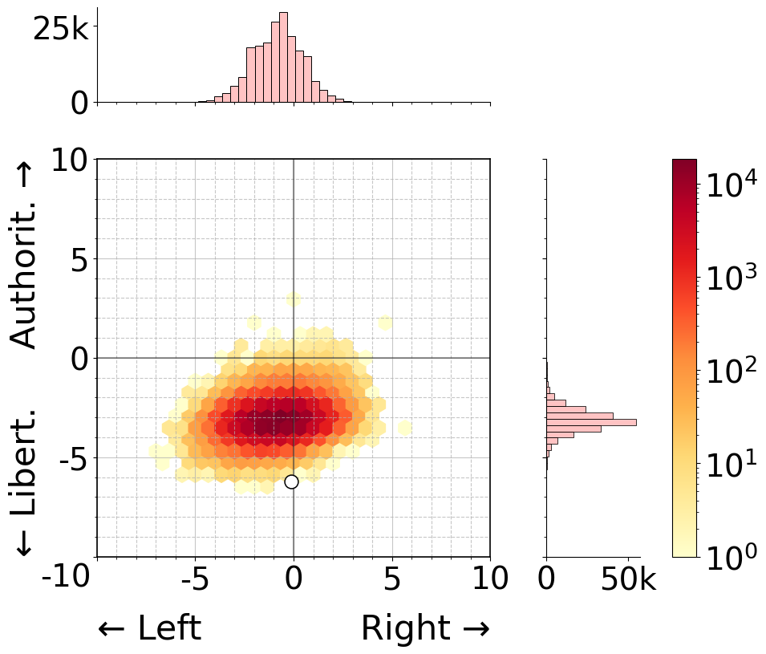

# LLM Political Personas

[](https://doi.org/10.5281/zenodo.14879668)
[](https://arxiv.org/abs/2412.14843)
[](https://doi.org/10.5281/zenodo.14816665)

This repository contains the code to replicate the experiments and results from our paper "[Mapping and Influencing the Political Ideology of Large Language Models using Synthetic Personas](https://arxiv.org/abs/2412.14843)" (WWW '25).

## 📚 Overview

Current research has shown that Large Language Models (LLMs) typically exhibit political biases when evaluated through frameworks like the Political Compass Test (PCT), generally leaning towards economically left and socially liberal positions. While these biases have been well-documented, the impact of persona-based prompting on LLMs' political orientations remains largely unexplored.

Our study bridges this gap by investigating:

1. How diverse synthetic persona descriptions affect LLMs' positions on the Political Compass Test
2. To what extent explicit ideological elements in persona descriptions can influence LLMs' Political Compass Test outcomes

## 🔍 Key Findings

- **Baseline Distribution**: Synthetic personas predominantly cluster in the left-libertarian quadrant across all tested models
- **Model-Specific Variations**: 
  - Zephyr exhibits the highest concentration of personas around its centroid
  - Llama's persona distribution shows the greatest variance
- **Ideological Malleability**:
  - All models demonstrate significant shifts towards right-authoritarian positions when prompted
  - Models exhibit more limited shifts towards left-libertarian positions
  - This asymmetry suggests inherent biases in model training

<p align="center">
  <table>
    <tr>
      <td align="center"><br>
        <em>Mistral-7B-Instruct-v0.3</em></td>
      <td align="center">        <br>
        <em align="center">Llama-3.1-8B-Instruct</em></td>
    </tr>
    <tr>
      <td align="center"><br>
        <em>Qwen2.5-7B-Instruct</em></td>
      <td align="center"><br>
        <em>Zephyr-7b-beta</em></td>
    </tr>
  </table>
</p>


## 🧪 Experimental Setup

Our experiments utilize:
- **PersonaHub**: A collection of 200,000 diverse synthetic persona descriptions
- **Political Compass Test**: 62 distinct statements across six key domains
- **Models**: Mistral-7B-Instruct-v0.3, Llama-3.1-8B-Instruct, Qwen2.5-7B, and Zephyr-7B-beta
- **Conditions**: Baseline (plain persona), right-authoritarian descriptor injection, left-libertarian descriptor injection

## 🛠️ Repository Structure


The data should be organized as follows:
```
data/
└── processed/            # Final processed datasets with political compass coordinates
└── raw/                  # Raw input data
└── interim/              # Intermediate processing results

utils/
└── policompass.py        # Political compass analysis utilities
└── s3helpers.py          # S3 data management utilities (originally the code was run on AWS)
```

## 📥 Data

Download the required datasets from our [Zenodo repository](https://doi.org/10.5281/zenodo.14816664) and place them according to the following structure:

```
data/
└── processed/                                 
    ├── Llama-3.1-8B-Instruct/
    │   ├── base/
    │   ├── right_authoritarian_personas/
    │   └── left_libertarian_personas/
    ├── Mistral-7B-Instruct-v0.3/
    ├── Qwen2.5-7B-Instruct/
    └── zephyr-7b-beta/
└── raw/
    ├── political_compass_statements.json
    └── token_personas.json
└── interim/                                      
```

## 📊 Reproduction Steps

1. **Data Preparation**:
   - Run `1.0.GenerateBasePrompts.ipynb` to generate base prompts
   - Run `1.1.GeneratePromptsTokenisedPersonas.ipynb` to generate prompts with ideological descriptors

2. **Model Inference**:
   - Run `2.LLMsInference.ipynb` to perform LLM inference across all conditions

3. **Data Processing and Analysis**:
   - Run `3.CombineSubdfs.ipynb` to combine results and compute political compass positions
     
4. **Data Visualization & Statistical Analysis**:
   - Run `4.Plot.ipynb` to generate publication-quality visualizations and perform statistical significance testing on the results

<!---
## 📄 Citation

If you use this code or our findings in your research, please cite our paper:

```bibtex
@inproceedings{bernardelle2025mapping,
  title={Mapping and Influencing the Political Ideology of Large Language Models using Synthetic Personas},
  author={Bernardelle, Pietro and Fr{\"o}hling, Leon and Civelli, Stefano and Lunardi, Riccardo and Roitero, Kevin and Demartini, Gianluca},
  booktitle={Companion Proceedings of the ACM Web Conference 2025},
  year={2025}
}
```
-->

## 🙏 Acknowledgments

This work is partially supported by the Australian Research Council (ARC) Training Centre for Information Resilience (Grant No. IC200100022) and by an ARC Future Fellowship Project (Grant No. FT240100022).
